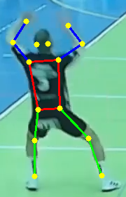
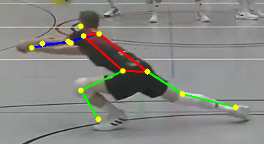

# Volleyball Reception Classification 

This repository contains a Jupyter notebook that documents the full development process of a machine learning model used to classify volleyball receptions as either **"upper"** or **"lower"**, using only **skeleton keypoints** extracted via pose estimation.

## What's Inside the Notebook

- Motivation and problem framing  
- Keypoint data extraction (based on YOLO pose estimation)  
- Dataset cleaning and preparation  
- Augmentation strategies  
- Feature preprocessing  
- Model design, training, and validation  
- Inference pipeline  
- Evaluation metrics and detailed discussion of results  
- Visualizations of example poses  
- Final conclusions and recommendations

## Example Visualization

Below are two example frames used in the dataset after pose estimation. They illustrate the distinction between the **upper reception** and **lower reception** classes, based solely on the player's body posture and arm positioning:

**Upper Reception (Keypoints Overlayed)**  

**Lower Reception (Keypoints Overlayed)**  

